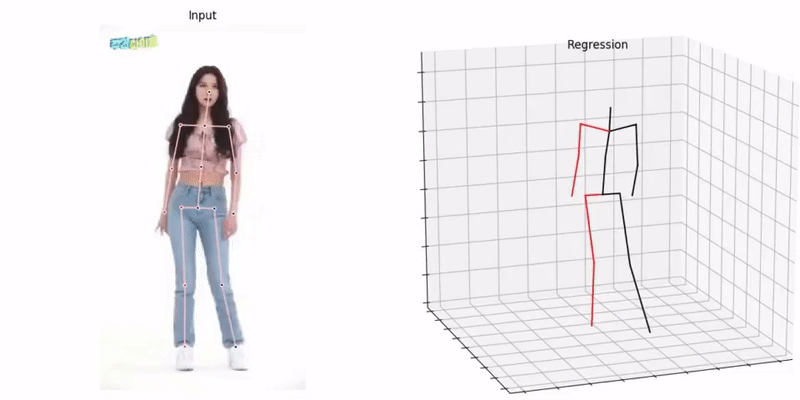
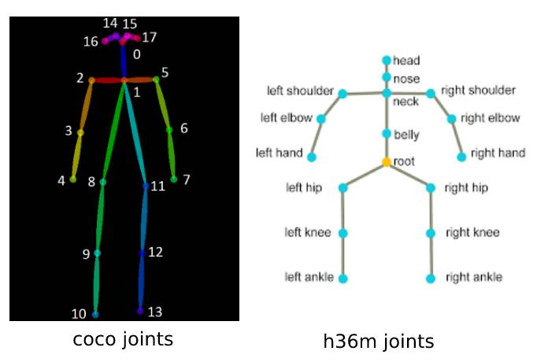

# Poseaug-inference-Video-Visualize
## [들어가기 전에]

이 코드는 [PoseAug](https://github.com/jfzhang95/PoseAug)를 사용자의 비디오에 적용하고, visualization 할 수 있게 설계된 코드입니다. 입력 video에서 2d keypoint를 추출은 detectron2를 사용하였고, vizualization은 VideoPose3D를 참고해 적용했습니다. 아래의 내용은 위 코드에 관한 사용법과 추가된 함수에 대한 설명입니다.

<center><center>
<center><center>


**기존 poseaug에 추가한 함수**

`/common/render.py`, `/data/prepare_data_2d_custom.py` , `/function_poseaug/data_preparation_custom.py` , `/run_poseaug_custom.py`

### 1. **2D Keypoints 추출**

```
cd inference
python infer_video_d2.py \
    --cfg COCO-Keypoints/keypoint_rcnn_R_101_FPN_3x.yaml \
    --output-dir output_directory \
    --image-ext mp4 \
    input_directory
```

input_directory, output_directory는 inference 폴더 안에 별도로 만드셔야 합니다.

### 2. **Custom dataset 생성**

-데이터셋의 이름을 정해줍니다. (저는 mine 으로 설정 했습니다.)

```
cd data
python prepare_data_2d_custom.py -i path/to/output_directory -o mine
```

-i 뒤 path를 현재 디렉토리에서 output_directory로의 경로로 설정해줍니다

### [ prepare_data_2d_custom.py 이해 ]

- keypoints rearrange  ( def coco_2_h36m )

PoseAug는 h36m format의 2d keypoint를 사용합니다. 우리가 1번에서 추출한 2d keypoint는 COCO format으로 keypoint의 배열이 맞지 않습니다. 그래서 coco_2_h36m 함수를 이용해 기존 coco 배열을 h36m 배열로 바꿔주었습니다. 연산 과정의 이해는 하단의 annotation과 함수 내 주석을 참고해주세요.

<center><center>
    
coco_annotation

0: nose, 1: Leye, 2: Reye, 3:Lear, 4: Rear
5: Lshoulder, 6:Rshoulder, 7: Lelbow, 8: Relbow
9: Lwrist, 10: Rwrist, 11: Lhip, 12: Rhip
13: Lknee, 14: Rknee, 15: Lankle, 16: Rankle

h36m_annotation
0: Hip, 1: RHip, 2: RKnee, 3: RFoot
6: LHip, 7: LKnee, 8: LFoot
12: Spine, 13: Thorax, 14: Neck/Nose, 15: Head
17: LShoulder, 18: LElbow, 19: LWrist
25: RShoulder, 26: RElbow, 27: RWrist


    
(+) Head joint의 경우, coco의 nose joint를 사용했습니다만, poseaug측에서 추천한 방법은 *When missing joint definition in Head, we generate the Head joint by extending the vector from Pelvis to Thorax in a fixed ratio (0.4)* ([https://github.com/jfzhang95/PoseAug/issues/4](https://github.com/jfzhang95/PoseAug/issues/4)) 임을 참고해주세요.

### 3. **PoseAug 실행**

```
python run_poseaug_custom.py --dataset custom --keypoints mine --evaluate ./checkpoint/poseaug/videopose/gt/poseaug/ckpt_best_dhp_p1.pth.tar --render --viz-subject input_video.mp4 --viz-action custom --viz-camera 0 --viz-video path/to/input_video.mp4 --viz-output output.mp4 --viz-size 6
```

### [ CustomDataset 의 이해]

```
# run_poseaug_custom.py line 31
data_dict = data_preparation_custom(args) 
 
# data_preparation_custom.py line 21
dataset = CustomDataset('data/data_2d_'+ args.dataset + '_' + args.keypoints + '.npz' )
```

( [VideoPose3D](https://github.com/facebookresearch/VideoPose3D) 의 코드를 참고해 변형하였습니다.)

CustomDataset 클래스는 dataset의 선언된 value값을 다루는 클래스로, custom dataset에 model과 render에 필요한 value 값을 알맞게 넣어줍니다.

- 보통의 3d pose estimation의 코드들은 17개의 joint를 사용합니다. 하지만, PoseAug는 **'Neck/Nose' keypoint를 제거한 16개의 keypoint를 사용함**을 유의해주세요. ( #h36m_annotation 의 14번)
    
    ```
    # common/custom_dataset.py line 56
    if remove_static_joints:
    	self.remove_joints([4, 5, 9, 10, 11, 14, 16, 20, 21, 22, 23, 24, 28, 29, 30, 31])
    ```
    
    데이터셋의 2d keypoint는 skeleton 클래스로 하나의 뼈대를 이루게 됩니다. 그 과정에서 각 keypoint의 parents를 설정해주어 각 keypoints간의 연결을 정의해줍니다. (ex Lshoulder parent is : Neck, Lelbow parent is : Lshoulder, Lwrist parent is : Lelbow) skeleton.remove_joints()는 skeleton의 메소드로 skeleton에 정의되어 있는 joint 중 사용하지 않는 joint를 삭제해줍니다. PoseAug의 설정에 맞게 14번을 추가했습니다. 
    
- reconnect parents
    
    ```
    # common/custom_dataset.py line 67
    self._skeleton._parents[10] = 8
    self._skeleton._parents[13] = 8
    ```
    
    10번과 13번의 parents를 8번 head와 연결해줍니다.
   
